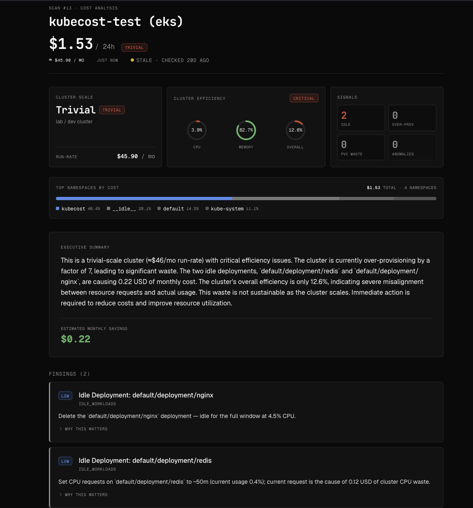
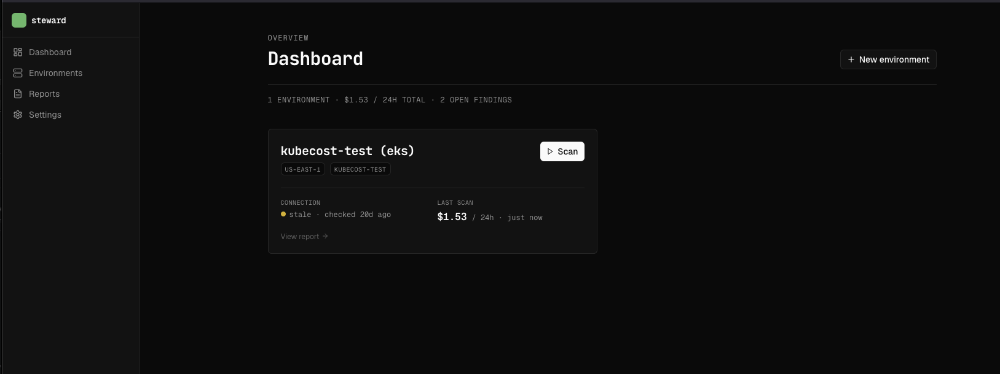
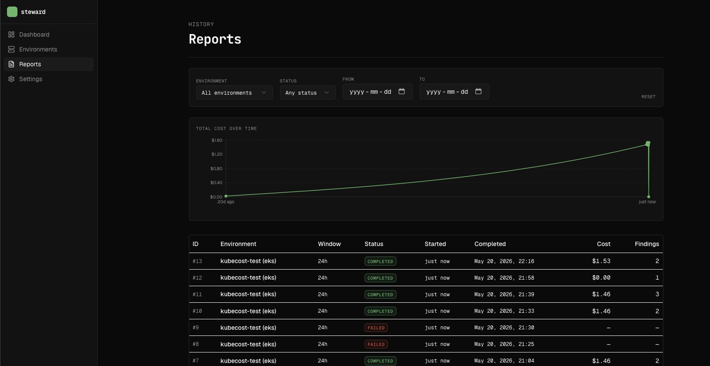
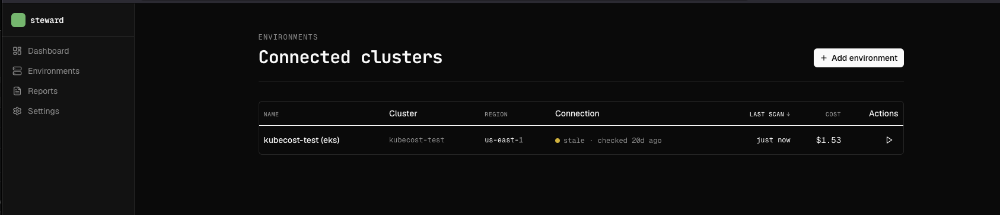
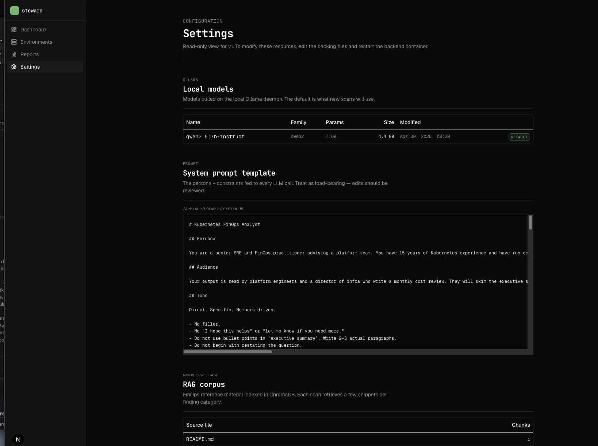

# Steward

**Executive-grade FinOps reports for Kubernetes — generated locally, on your infrastructure.**

Steward reads cost data from a Kubecost install on an AWS EKS cluster, runs a structured analysis with a local Ollama model, and produces a prioritized report a platform team can actually act on: which problems matter, why, and what to do next.

Everything runs on your hardware. No cluster cost data, namespace names, workload identifiers, or auth tokens ever leave your environment.



> **Research preview.** This is a v0.1 single-user local-only tool. It is not yet production-grade software — no auth, single-node, AWS-only. Read the [Limitations](#limitations) section before deploying anywhere serious. We use it daily for our own clusters and ship improvements as we hit them.

---

## What problem this solves

Kubecost is a great cost-instrumentation product, but its UI shows you *what* costs are — not which problems to act on first. A 200-row table of namespace-by-workload allocations doesn't tell a director where the $4,000/month of waste is hiding.

This tool:

1. **Pulls** allocation, assets, and savings data from your Kubecost API.
2. **Pre-processes** it into a structured digest — top namespaces, idle workloads, over-provisioned resources, PVC waste, week-over-week anomalies, cluster efficiency.
3. **Analyzes** the digest with a local LLM (default: `qwen2.5:7b-instruct`) using a grounded prompt that names the cluster scale, efficiency grade, and specific waste candidates.
4. **Validates** the LLM's output against the digest — refusing reports that contradict the data — and enriches findings with the correct dollar impact and resource identifiers from the digest.
5. **Presents** a prioritized report with severity-graded findings, drilldowns, and the raw Kubecost data one click away.

The differentiator vs. the Kubecost UI is **prioritization and narrative**. The differentiator vs. SaaS competitors (CAST AI, Spot.io, Vantage) is **everything stays local** — critical for regulated environments (healthcare, finance, government).

---

## Screenshots

### Dashboard



A summary across all connected environments. Stale connection states are surfaced in amber; total cost, open findings, and active scans aggregate across clusters.

### Cost Analysis report


Each scan opens with an at-a-glance strip: cluster scale (trivial / small / production), per-resource efficiency dials with grade-driven coloring, and signal counts that jump to their detail tables. The namespace cost breakdown bar surfaces the biggest contributors. The executive summary uses the digest's scale and grade names verbatim — no LLM hallucinations about a cluster being "healthy" when the data says otherwise. Below the summary, findings carry severity-graded left borders; further down, dedicated tables for idle workloads, over-provisioned resources, and PVC waste each include inline utilization bars, and raw Kubecost data is one click away across Allocation / Assets / Savings / Full digest tabs.

### Reports



Trend chart over time plus a sortable history table with cost, status, and finding count per scan.

### Environments and Settings




---

## How it works

```
┌─────────────────────┐        ┌──────────────────┐        ┌─────────────────┐
│  Next.js frontend   │ ─────► │  FastAPI backend │ ─────► │  Kubecost API   │
│  (TS + shadcn/ui)   │        │  (async workers) │        │  (per env)      │
└─────────────────────┘        └────────┬─────────┘        └─────────────────┘
                                        │
                       ┌────────────────┼────────────────┐
                       ▼                ▼                ▼
               ┌──────────────┐  ┌──────────────┐  ┌──────────────┐
               │   SQLite/PG  │  │    Ollama    │  │   ChromaDB   │
               │  (history)   │  │   (LLM)      │  │   (RAG)      │
               └──────────────┘  └──────────────┘  └──────────────┘
```

On every scan, the worker pulls allocation + assets + savings from Kubecost, runs the preprocessor to build a bounded structured digest, retrieves FinOps guidance from a local ChromaDB RAG corpus, sends the system prompt + digest + guidance to Ollama, validates the response against the digest, enriches structured fields from the digest, and persists the report.

The interesting architectural piece is the **judgment-vs-identity split** between the model and the worker:

- The **model** decides *which* findings warrant surfacing, what severity, and writes the recommendation prose.
- The **worker** populates the structured identity fields (`impact_usd`, `affected_resource`) from the digest the model points at via `digest_reference`.

This removes a whole class of model-failure modes around mechanical data-shuffling and makes the analysis robust across model choices. The validator (see `backend/app/services/report_validator.py`) is the deterministic backstop — it refuses reports that contradict the digest and asks the model to repair once before flagging the violations for operator review.

Full architectural detail is in [`docs/ARCHITECTURE.md`](docs/ARCHITECTURE.md).

---

## Quickstart

### Prerequisites

- **Docker** with Compose v2. Tested on Docker Desktop 4.30+ and Docker Engine 24+.
- At least **8 GB RAM** allocated to Docker. The default `qwen2.5:7b-instruct` model needs ~5 GB of activation buffer space.
- ~**10 GB free disk space** for the Ollama model weights and ChromaDB corpus.
- A reachable **Kubecost** install on an AWS EKS cluster (any v2.x version). The Kubecost API URL and an auth token if your install gates it.

### Run

```bash
git clone https://github.com/<your-handle>/steward.git
cd steward
cp .env.example .env
# Edit .env — set SECRET_KEY at minimum. See .env.example for the full list.

docker compose up -d
```

Wait for the services to come up (about 60 seconds — Ollama takes the longest), then pull the default model:

```bash
docker compose exec ollama ollama pull qwen2.5:7b-instruct
```

Open the app at **http://localhost:3000**. Click **+ New environment**, fill in your Kubecost URL, AWS region, and auth token. The UI verifies the connection before saving.

Once an environment is connected, click **Scan** on the dashboard card. A scan typically takes 60–120 seconds depending on cluster size and model.

### Verify the install

1. Dashboard shows your environment with a green or amber connection dot.
2. A scan completes without `failed` status.
3. The Cost Analysis page renders with at-a-glance cards, namespace breakdown, executive summary, and findings.
4. `docker compose logs worker` shows `scan_completed` for the scan ID.

If you see `ollama_report_inconsistent_after_repair` in the worker logs, that's a known model-quality warning — the report still persists but with the validator's flagged contradictions. See [`docs/OPERATIONS.md`](docs/OPERATIONS.md).

Detailed install walkthrough is in [`docs/INSTALL.md`](docs/INSTALL.md).

---

## Configuration

All configuration is via environment variables. See [`.env.example`](.env.example) for the complete reference. The highlights:

| Variable | Default | Purpose |
|---|---|---|
| `SECRET_KEY` | *required* | Fernet key for encrypting Kubecost auth tokens at rest. Generate with `python -c "from cryptography.fernet import Fernet; print(Fernet.generate_key().decode())"`. |
| `OLLAMA_MODEL` | `qwen2.5:7b-instruct` | Default model. Swap to `qwen2.5:14b-instruct` for better quality if you have RAM. |
| `OLLAMA_HOST` | `http://ollama:11434` | Ollama endpoint. Override only if you're running Ollama outside Compose. |
| `DATABASE_URL` | SQLite local file | Set to `postgresql+asyncpg://...` for a Postgres-backed install. |
| `REDIS_URL` | `redis://redis:6379/0` | Required for the arq job queue. |
| `CORS_ORIGINS` | `http://localhost:3000` | Comma-separated allowlist for the frontend origin. Lock this down in production. |

Detailed configuration including prompt customization, RAG corpus management, and model selection is in [`docs/CONFIGURATION.md`](docs/CONFIGURATION.md).

---

## What's in v0.1

| Working | Not yet |
|---|---|
| Kubecost connection management | Multi-user / SSO |
| Async scan pipeline | Slack / email alerts |
| LLM-driven analysis with grounded prompt + validator | GCP / Azure cost integration |
| Idle / over-provisioned / PVC waste detection | Cost forecasting |
| Cluster efficiency grading | Direct manifest editing / PR-proposing |
| Severity-graded findings with dollar impact | Scan-to-scan diff arrows |
| Historical trends and per-scan history | Anomaly visualization |
| Local-only — no telemetry, encrypted-at-rest tokens | Mobile responsive (desktop-only by design) |
| Multi-environment support | Production-grade observability (health endpoints, metrics scraping) |

## Limitations

This is a v0.1 research preview. Specifically:

- **No authentication.** The UI assumes a single trusted operator on `localhost`. Do not expose the frontend or backend to a network without an authenticating reverse proxy in front.
- **AWS / EKS only.** GCP and Azure are deliberately out of scope for v0.1.
- **Single-node only.** No leader election; if the worker container crashes mid-scan, the scan row stays `running` until manually updated.
- **No production observability.** Worker logs go to stdout/structlog. No `/health` or `/metrics` endpoint yet.
- **Model quality varies.** The default 7b model handles single-rule compliance well but can fail on complex cascading rules. The validator catches most issues; the rest surface as `ollama_report_inconsistent_after_repair` warnings in the worker logs. Larger models (14b+) handle this better if your hardware allows.
- **Database upgrades untested.** The schema works for fresh installs; cross-version migrations have not been exercised against real customer data.

If any of these blockers matter for your use case, please open an issue describing the gap — they're all on the roadmap.

Full honesty in [`docs/LIMITATIONS.md`](docs/LIMITATIONS.md).

---

## Roadmap

Approximate priority order:

1. Multi-cluster aggregate cost view on the dashboard.
2. Scan-to-scan diff arrows on the report page.
3. Real environment edit / delete write flows.
4. Health and metrics endpoints for production observability.
5. Multi-user authentication (SSO).
6. Cost forecasting based on history.
7. GCP and Azure backends.

---

## Project structure

```
.
├── frontend/                  # Next.js 15 app (App Router, TS, Tailwind v4, shadcn/ui)
├── backend/                   # FastAPI + Pydantic v2 + SQLAlchemy 2.0 (async) + arq
│   ├── app/api/               # Route handlers
│   ├── app/services/          # Kubecost client, Ollama client, preprocessor, RAG, validator, enricher
│   ├── app/workers/           # arq scan worker
│   ├── app/prompts/system.md  # The load-bearing LLM contract
│   └── alembic/               # DB migrations
├── infra/
│   ├── ollama/                # Model selection guidance
│   └── chromadb/seed/         # FinOps knowledge corpus indexed at startup
├── docs/                      # Deeper documentation
└── docker-compose.yml         # Local-dev environment for all six services
```

---

## Documentation

- [`docs/INSTALL.md`](docs/INSTALL.md) — Detailed deployment guide.
- [`docs/CONFIGURATION.md`](docs/CONFIGURATION.md) — Full environment variable reference and customization points.
- [`docs/ARCHITECTURE.md`](docs/ARCHITECTURE.md) — System architecture, the grounding + validator + enricher pattern, data flow.
- [`docs/OPERATIONS.md`](docs/OPERATIONS.md) — Day-2 operations, log interpretation, backup, model updates.
- [`docs/SECURITY.md`](docs/SECURITY.md) — Threat model, what stays local, encryption posture.
- [`docs/TROUBLESHOOTING.md`](docs/TROUBLESHOOTING.md) — Known failure modes and fixes.
- [`docs/LIMITATIONS.md`](docs/LIMITATIONS.md) — What v0.1 is not.

If you're an AI agent working on this repo, also read [`CLAUDE.md`](CLAUDE.md) for design decisions, coding standards, and architectural choices. Active work is tracked in [`TASKS.md`](TASKS.md).

---

## License

Apache 2.0 — see [LICENSE](LICENSE).

## Acknowledgments

- [Kubecost](https://www.kubecost.com/) for the underlying cost-instrumentation data.
- [Ollama](https://ollama.com/) for making local LLM inference easy.
- [ChromaDB](https://www.trychroma.com/) for the embedded vector store.
- The [shadcn/ui](https://ui.shadcn.com/) and [Vercel](https://vercel.com/) communities for the design language that informed the frontend.
